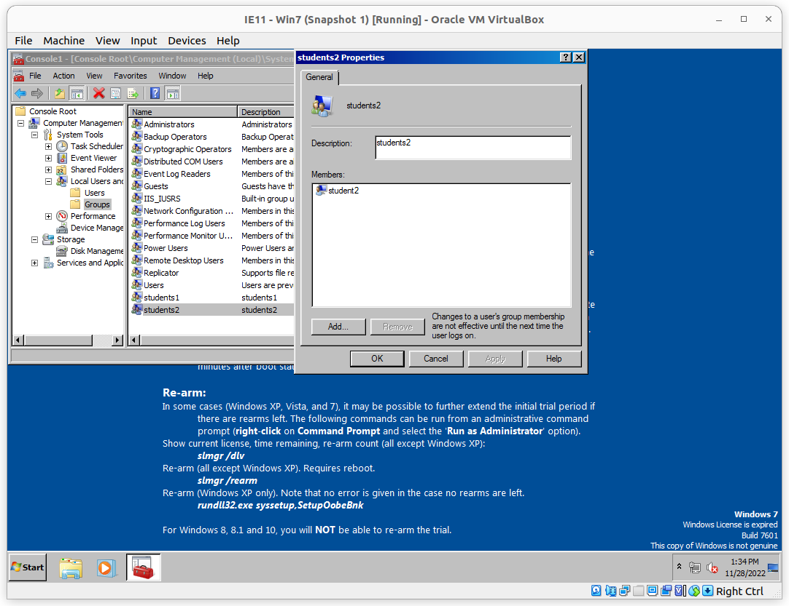
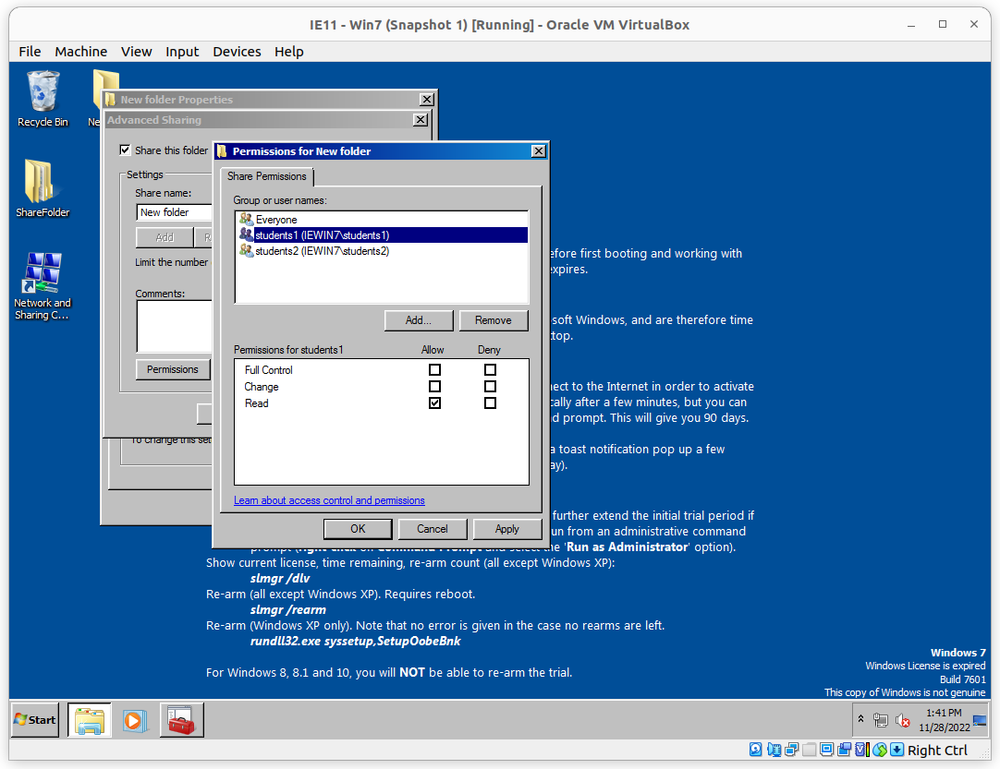
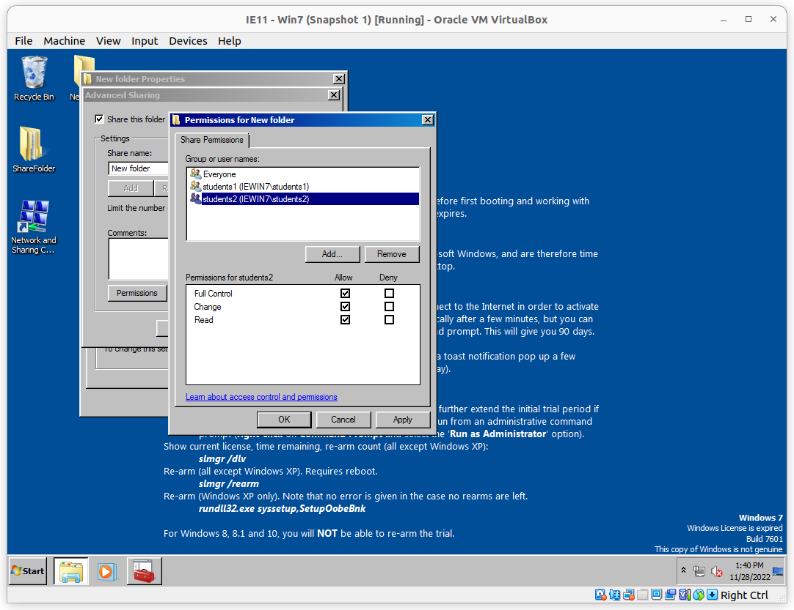
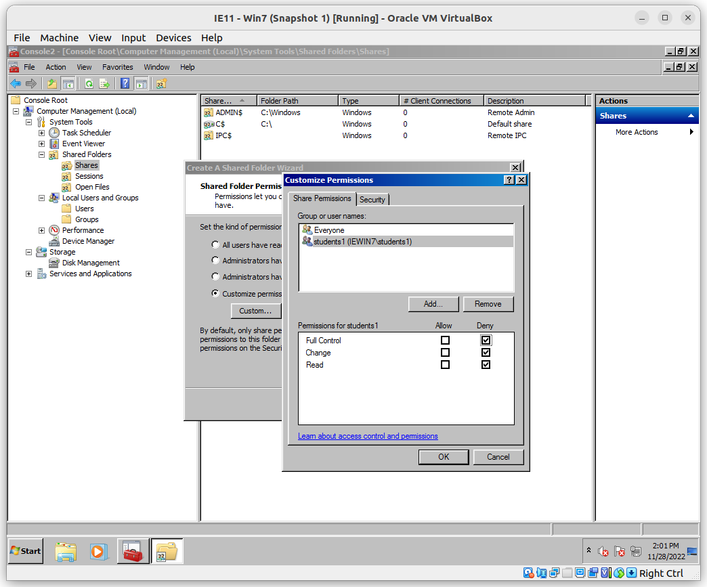
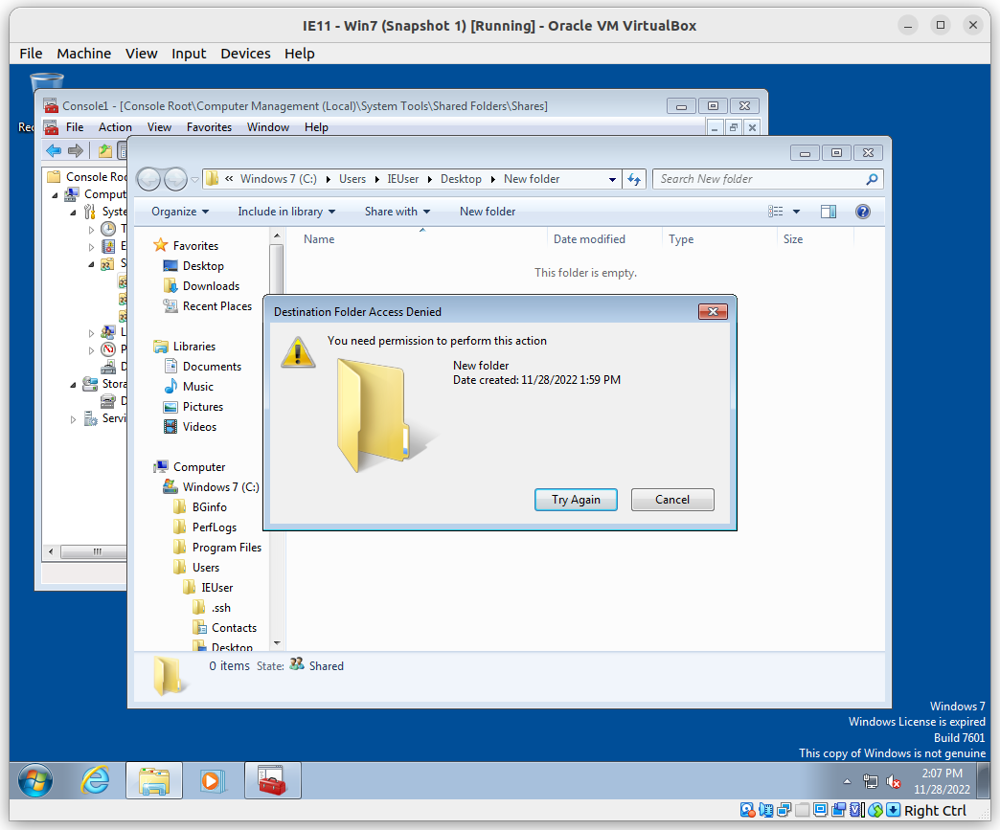

# Домашнее задание к занятию «Windows Hardening»
[задание](https://github.com/netology-code/ibdef-homeworks/tree/master/02_windows)

# Задание 1

Student1

Student2

# Задание 2

Students1

Students2

Все остальные

# Задание 3

Запрет на доступ __Students1__

Все остальные доступ имеют

Проверка от пользователя: __student1__

