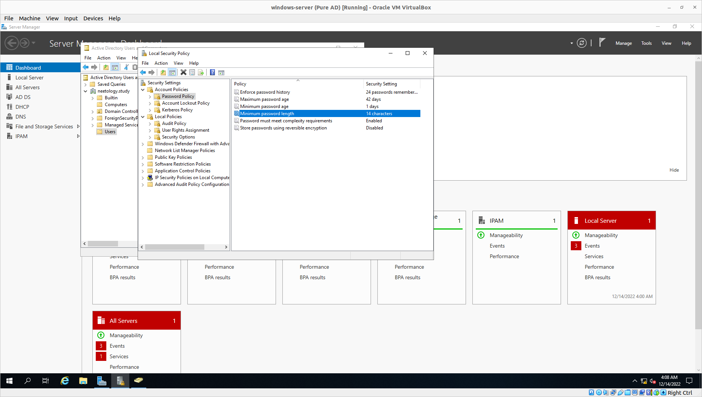
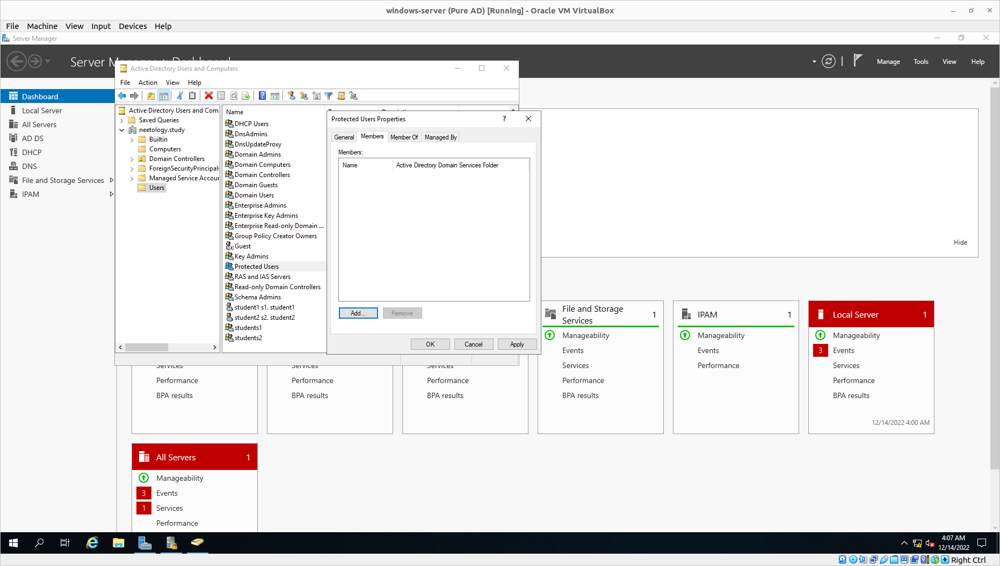
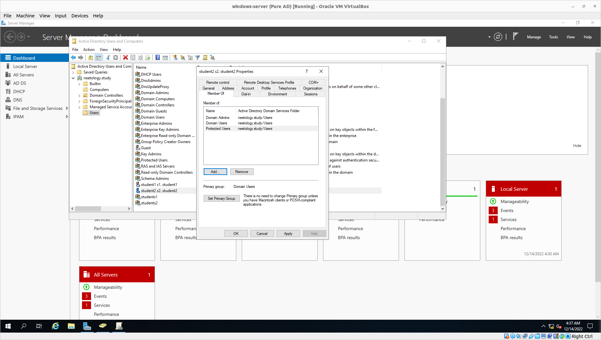
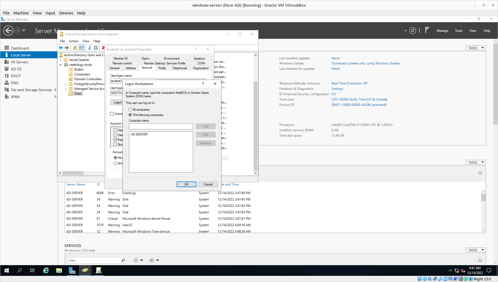
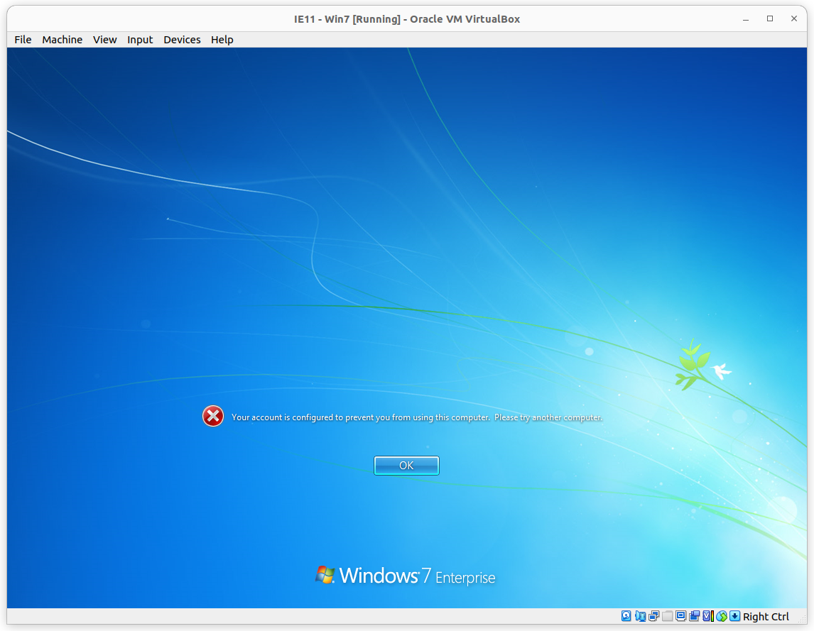
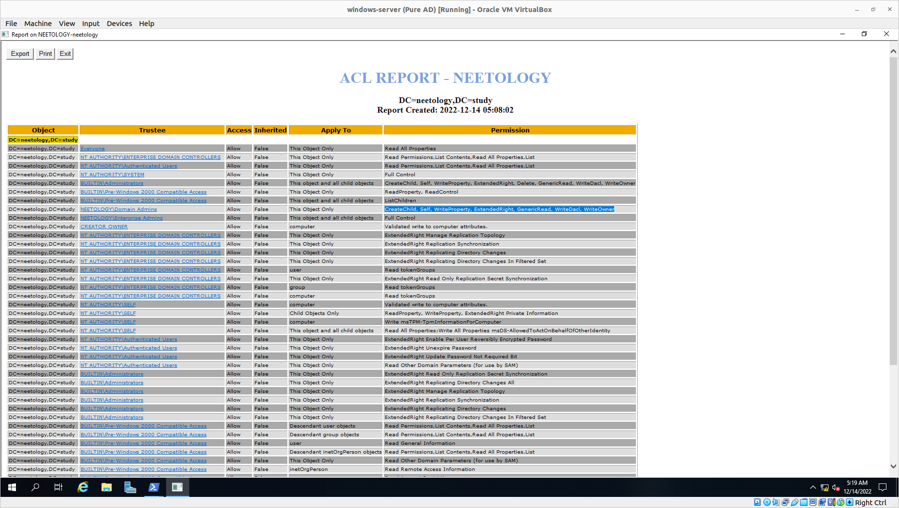
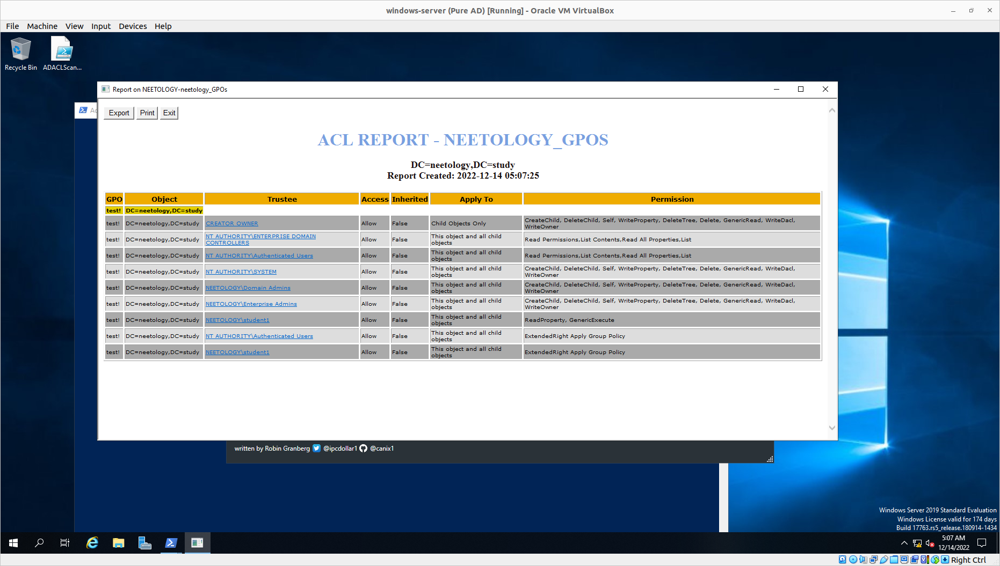
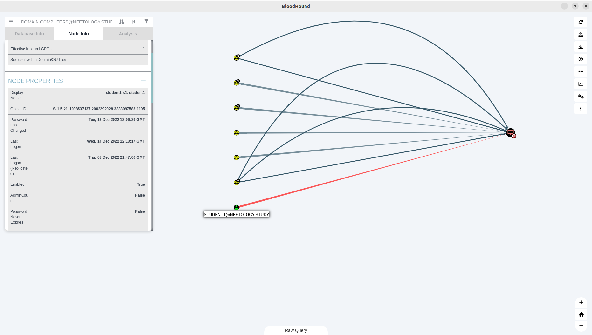
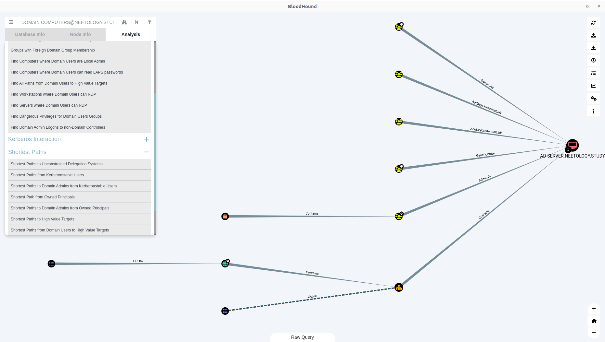

## Домашнее задание к занятию «Active Directory. Часть 2»
[Задание](https://github.com/netology-code/ibdef-homeworks/tree/master/04_ad2)
### Задание 1
В соответствии с лекцией:
1. **Длина пароля должна составлять 10-15 символов**, на моём сервере установлено 7 символов.

2. **Запрет доступа к сети интеренет для DC, администраторы должны использовать только выделенные АРМ и отдельную сеть для администрирования, удаленный доступ к DC должен быть ограничен только сетью администрирования.** На сервере по умолчанию не настроена сеть VPN, или что-то подобное, удаленный доступ к сети запрещен только фаэрволом, в настройках АД удаленное управление разрешено. К сети виртуальная машина подключена, это можно выключить, но так как это виртуальные машины,мы делаем это только условно.
3. **все администраторы должны относится к Protected Users** Предполагается, что члены этой группы получают дополнительный уровень ненастраиваемой защиты против компрометации учетных данных во время выполнения процедуры проверки подлинности. На моём сервере эта рекомендация не выполнена по дефолту. 

4. **Администраторы домены не должны заходить на рабочие станции пользователей локально.** Эта политика не настроена. Как выход я предлагаю дать пользователю права администратора домена и создать белый список компьютеров, на которые ему можно заходить.



5. **Минимальный аудит для DC.** Не настроены локальные политики по дефолту.
[Вот тут](https://documentation.solarwinds.com/en/success_center/arm/content/configure-audit-policies-for-the-domain-controllers.htm) есть список для аудита сервера. Туда рекомендуют вносить аудит по изменению статуса ролей, групп, компьютеров и т.д.
6. **Встроенные группы.** Существуют по дефолту, но при создании инфраструктуры стоит использовать свои. 
7. **Шифрование разделов DC.** Не используется по дефолту. Нужно установить в качестве роли bitlocker и зашифровать диски контроллера домена. 
8. **Корзина для AD.** Выключена. Но в "AD Administrative Center" можно её включить.
9. **Удалить локальных администраторов на компьютерах домена**. Можно сделать через груповые политики:
```
Computer Configuration > Policies > Windows Settings > Security Settings > Local Policies > User Rights Assignments
```
### Задание 2 AD ACL Scanner
Эта утилита нужна для просмотра доступа участников и объектов доменов друг к другу. Так же можно проанализировать на кого распространяются групповые политики.  



### Задание 3 Bloodhound. 
С помощью этой программы можно анализировать поверхность атаки с точки зрения злоумышленника или пентестера и анализировать структуру домена с точки зрения администратора. Например на скриншоте снизу видно, на какой компьютер и когда логинился пользователь student1, когда он менял пароль:


А на этом скриншоте видны групповые политики и к кому они применены:


