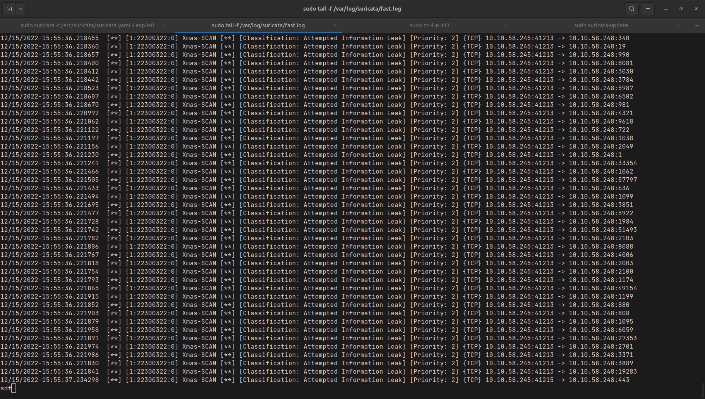
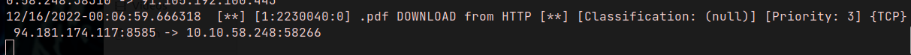

# Мониторинг сетевых событий (Suricata)

[Задание](https://github.com/netology-code/ibdef-homeworks/tree/master/05_ids)

### Задание 1
```bash
alert tcp any any -> any any (msg: "Xmas-SCAN"; flow:stateless; flags:UPF; classtype:attempted-recon;sid:22300322;)
```
**Результат:**


### Задание 2

```bash
alert ip any any -> any 53 (msg: "DNS-request"; app-layer-protocol:!dns; sid:2230035;)
```

### Задание 3

Удалось только написать правило для HTTP, потому что этот трафик не шифруется и его можно анализировать.
```
alert ip any any -> any any ( msg: ".pdf DOWNLOAD from HTTP"; fileext:"pdf"; sid:2230040;)
```



