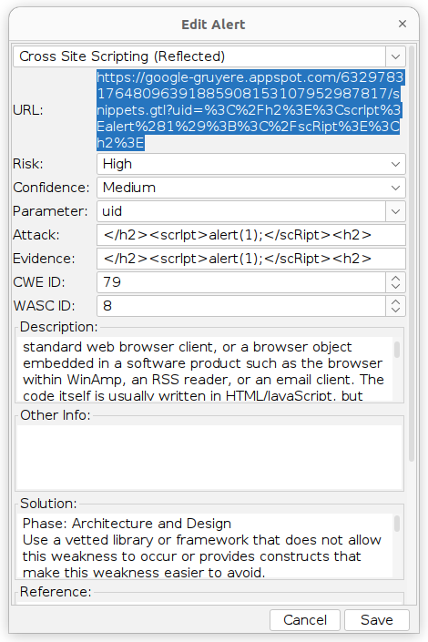
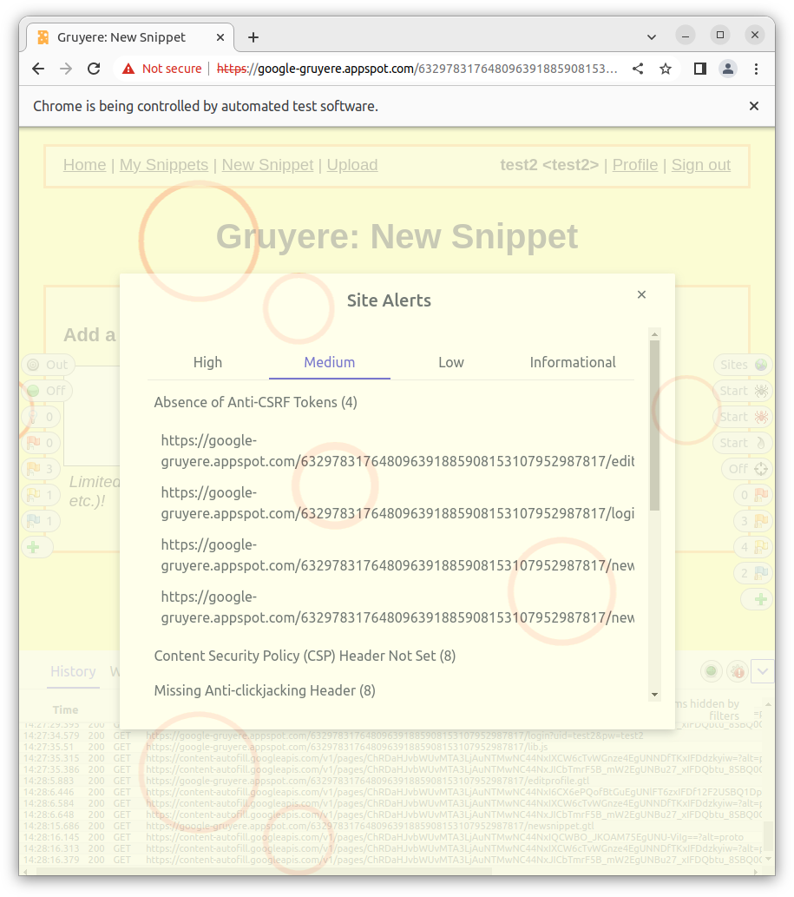

# «Penetration Testing. Часть 1»

[Задание](https://github.com/netology-code/ibdef-homeworks/tree/master/06_pentest)


## Задание 1

Целью для поисков выбрал компанию-производителя, продуктами которой я пользуюсь каждый день, для работы.
Называются они "Автоматика плюс"

[Их сайт](http://www.automatikaplus.ru/default.aspx)

Решил найти IP адрес их сайта, ```nslookup www.automatikaplus.ru ```, получаю ```188.225.36.85```. В гугле нахожу информацию, что это хостинг из Санкт-Петербурга, значит сервер стоит не у них, а они пользуются хостингом (физически они находятся в Пензе).
С помощью shodan посмотрел, что сервер на Windows, там открыт 443 порт и лежит сертификат, который не доступен , если просто заходить на сайт, так же открыты RDP, VNC сервисы для управления этим сервером. 

На сайте есть ссылка на форум. Решил поискать администраторов форума. loginov_d - один из самых активных участников форума, просто гуглю его ник. Нахожу его [личный сайт](http://www.loginovprojects.ru/index.php?page=simple). Сайт хостится на том же IP, что и основной сайт автоматики. На его личном сайте есть комментарии, где с 2005 года с ним разговаривают его друзья и видимо одногруппники, студенты. Можно использовать их email, так как они в открытом виде там лежат и использовать социальную инженерию, направив её на администратора. 

<details>
  <summary>**Тут дополнительно, не очень применимо к самой автоматике**</summary>
  
Так как я работаю с их продуктом, знаю о уязвимости "из первых рук". Проблема в мисконфигурации, если не указать отдельно пароль администратора одного из сервисов, он доступен (неявно) из интернета. т.е. если люди не пользуются этим сервисом, либо не знают о нем и не указывают пароль по этим причинам - можно получить доступ ко ВСЕМ транзакциям с контрагентами. Решил проверить, есть ли где-то такой личный кабинет. 


Доступно 4 кабинета, у первого, если после адреса написать /azs/ (это доступ к веб сервису не для клиентов) нет пароля администратора. Проверять, есть ли там транзакции не стал, на всякий случай. 
IP принадлежит Братску. В Братске не так много заправок. 


У крупных брендовых заправок не может быть именно этого сервиса, остались "братский бензин" и "илим-роско". У первых есть этот сервис. Ребят предупредил, вдруг им интересно. 


</details>

В ходе проделанной работы я нашел мало данных, связанных с самой организацией, но думаю всю эту информацию можно использовать совместно с социальной инженерией, чтобы получить другую информацию, полезную для пентеста. 

## Задание 2

### XSS

Находится автоматически с помощью OWASP ZAP.




### XSRF

Согласно [википедии](https://ru.wikipedia.org/wiki/%D0%9C%D0%B5%D0%B6%D1%81%D0%B0%D0%B9%D1%82%D0%BE%D0%B2%D0%B0%D1%8F_%D0%BF%D0%BE%D0%B4%D0%B4%D0%B5%D0%BB%D0%BA%D0%B0_%D0%B7%D0%B0%D0%BF%D1%80%D0%BE%D1%81%D0%B0):
>**CSRF** (cross-site request forgery — «межсайтовая подделка запроса», также известна как XSRF) — вид атак на посетителей веб-сайтов, использующий недостатки протокола HTTP. Если жертва заходит на сайт, созданный злоумышленником, от её лица тайно отправляется запрос на другой сервер (например, на сервер платёжной системы), осуществляющий некую вредоносную операцию (например, перевод денег на счёт злоумышленника). Для осуществления данной атаки жертва должна быть аутентифицирована на том сервере, на который отправляется запрос, и этот запрос не должен требовать какого-либо подтверждения со стороны пользователя, которое не может быть проигнорировано или подделано атакующим скриптом. Распространённым способом защиты является механизм, при котором с каждой сессией пользователя ассоциируется дополнительный секретный уникальный __токен__ , предназначенный для выполнения запросов.




### XSSI

В соответствии с [этой статьёй](https://book.hacktricks.xyz/pentesting-web/xssi-cross-site-script-inclusion), чтобы проэксплуатировать XSSI, нужно проанализировать .js скрипты на атакуемом сайте. На этом сайте все скрипты ссылаются на .../lib.js
Принцип атаки: мы берем другой сайт, ссылаемся в нем на скрипт атакуемого сайта. Следующей строчкой вызываем alert(<тут нужная нам переменная из атакуемого сайта>). Значит нужно проанализировать /lib.js. Я не смог найти в этом скрипте переменных с "небезопасными" значениями. 
Но воспользовался подсказкой и там указано, что существует скрипт feed.gtl. Который содержит "private snippet". Делаем страницу:

```html
<script>
function _feed(s) {
  alert(s['private_snippet']);
}
</script>
<script src="https://google-gruyere.appspot.com/632978317648096391885908153107952987817/feed.gtl" type="text/javascript"></script>
```

Для проверки я загрузил её на этот сайт от пользователя test4 и открыл от пользователя test2. Всё получилось. Вывод: можно разместить на стороннем сайте подобный скрипт и если кто-то перейдет на этот сайт с атакуемого сайта, у этого человека украдут приватные данные. 

### Path Traversal

Эта атака пытается получить доступ к файлам и папкам, которые находятся вне папок, доступных "легально". На сервер можно загрузить файлы, которые потом доступны по адресу: .../username/file.ext

Я нашел [репозиторий](https://github.com/omurugur/Path_Travelsal_Payload_List/blob/master/Payload/Dp.txt) который содержит пэйлоад для этой атаки, с помощью фьюзера у owasp-zap нахожу, что часть из них работает, например этот:

```
https://google-gruyere.appspot.com/632978317648096391885908153107952987817/test4/%2e%2e%2f%2e%2e%2f%2e%2e%2f%2e%2e%2f%2e%2e%2f%2e%2e%2f%65%74%63%2f%70%61%73%73%77%64
```


```
https://google-gruyere.appspot.com/632978317648096391885908153107952987817/test4//..%5C../..%5C../..%5C../..%5C../..%5C../..%5C../etc/shadow
```


### Code Execution
Самостоятельно я эту уязвимость найти не смог. Принцип такой, что мы можем либо создать пользователя  ```..``` и загрузить туда файл ```gtl.py```. Либо сразу загрузить файл ```../gtl.py```. Так как сайт подвержен DOS атакам, мы перезапускаем сервер и код из файла ```gtl.py``` выполнится.