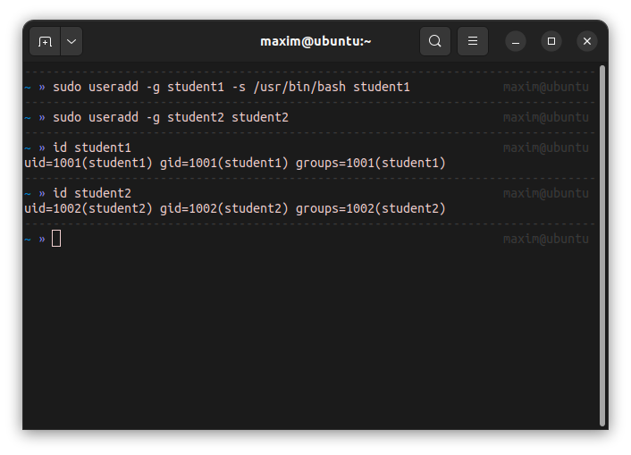

# Домашнее задание к занятию «Linux Hardening»
[{}](https://github.com/netology-code/ibdef-homeworks/tree/master/01_linux)

## Задание 1

## Задание 2

## Задание 3

### /etc/passwd

Режим доступа: -rw-r--r--  root root , т.е. читать и записывать может только пользователь root, читать могут все остальные.
 
В файле хранятся имена пользователей и их группы, стандартные оболочки, идентификаторы пользователей и групп, домашняя директория.

### /etc/shadow

Режим доступа: -rw-r----- root shadow, т.е. читать и записывать может только пользователь root, читать группа shadow, остальные не могут ничего. 

В файле храняться зашифрованые пароли пользователей, дата последнего изменения пароля, минимальный возраст пароля, максимальный возраст пароля, период предупреждения, период бездействия, дата окончания пароля.  

## Задание 4

### 1

SE linux - это модель безопасности, в которой атрибуты контроля доступа привязываются не к пользователям, а к программам. В ubuntu-server уже предустановлено приложение apparmor, которое так же как и selinux основана MAC.   
Так как основная проблема, из-за которой стоит установить selinux звучит как "приложения, запущенные пользователем имеют теже права доступа к файлам, что и сами пользователи", думаю, средствами стандартной ubuntu можно создать пользователей без прав доступа к важным файлам и от их лица запускать приложение, тогда получится пользоваться журналами и видеть неправомерный доступ. Но эта система выглядит даже более тяжеловесно, чем установка и настройка selinux. 

### 2

Да, установить её можно, это приложение есть в стандартных репозиториях Ubuntu.