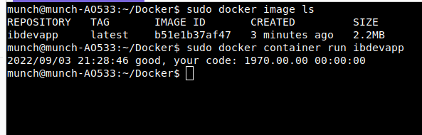
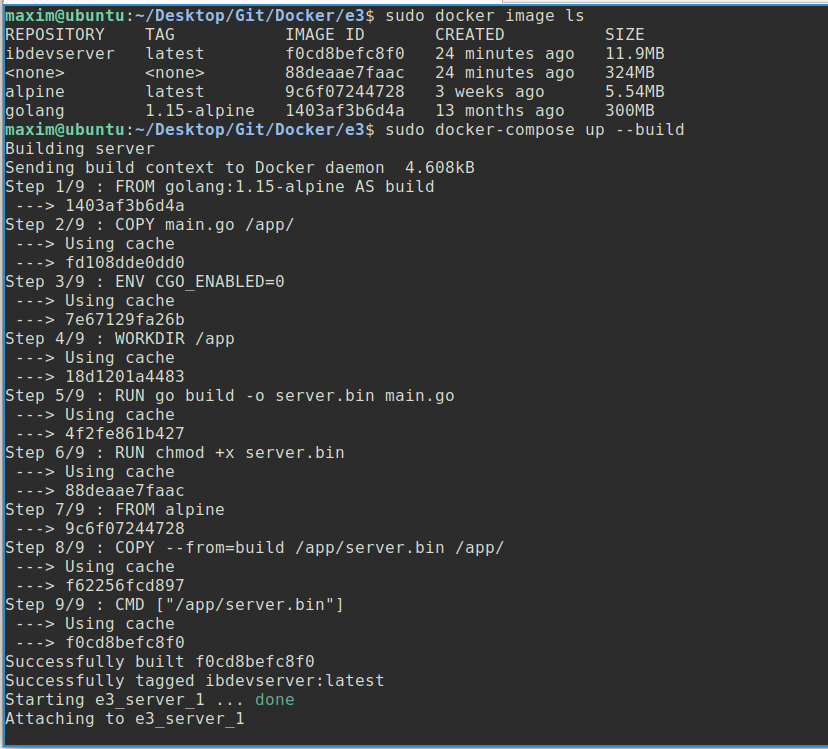

[Задание](https://github.com/netology-code/ibdev-homeworks/tree/master/01_docker)

## Задание №1. Создание Docker Image

## Задание №2. MultiStage Build

## Задание №3. CIS Benchmarks

### Пункт 4.1
Контейнер должен запускаться не от пользователя root. Без дополнительных настроек, контейнер запускается от пользователя root. Настраивается это в Dockerfile. Также на сервере создается специальный пользователей для таких контейнеров.

### Пункт 4.3
Контейнер должен быть легковесным настолько, насколько это возможно. Нужно проверять, установлены ли в контейнере необязательные программы и пакеты. Мы этого не делали в ходе выполнения задания 2.

