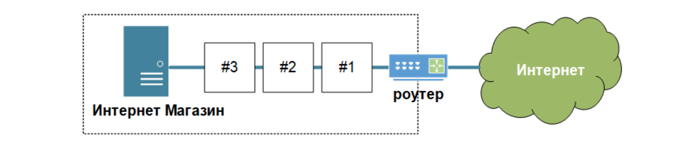
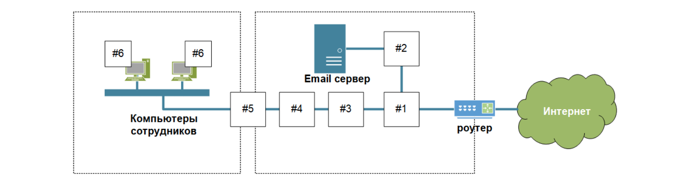

[Задание](https://github.com/netology-code/ibnet-homeworks/tree/v2/08_basics)

## Ритейл

#1 - для разграничения доступа из Интернета к публикуемому сервису 
Firewall (statefull). Думаю тут нужна простая версия межсетевого экрана, которая бы 	обеспечила работу нашего сервера. Контроль отрытых портов, возможно нужна 	геологическая фильтрация входящего трафика. 
#2 - для определения и подавления DDoS атаки на ваш интернет магазин 
Система защиты от DDoS атак на уровне приложений.
#3 - для определения и блокирования сложных WEB атак на ваш интернет-магазин, когда злоумышленники используют SQL инъекцию для получения доступа к вашей базе клиентов 
Предположу, что в целях экономии, можно объединить цели 1 и 3 и установить туда 	Web Aplication Firewall, который может обнаруживать сложные атаки.

## Промышленность

#1 для разграничения доступа из Интернета в DMZ 
Firewall (statefull). Контроль отрытых портов, возможно нужна геологическая 	фильтрация входящего трафика. 
#2 для защиты электронной почты от вирусов и спама 
Антивирусное ПО , работающее на самом сервере. (сигнитурный метод)
#3 - для определения и блокирования вредоносного ПО 
Антивирусное ПО , работающее на сетевом оборудовнии. ( sandbox).
#4 для контроля WEB трафика, URL фильтрации 
Proxy сервер с настройкой фильтрации трафика.
#5 для разграничения доступа между корпоративной сетью и DMZ 
Межсетевой экран. Нужен тут для сегментации демилитаризованой зоны и компьютеров сотрудников. 
#6 для защиты от вредоносного ПО на рабочей станции 
Антивирус на каждый компьютер. 

Предположу, что пункты 2,3,4 – это прокси сервер с фильтрацией трафика между компьютерами сотрудников, антивирусным ПО,

