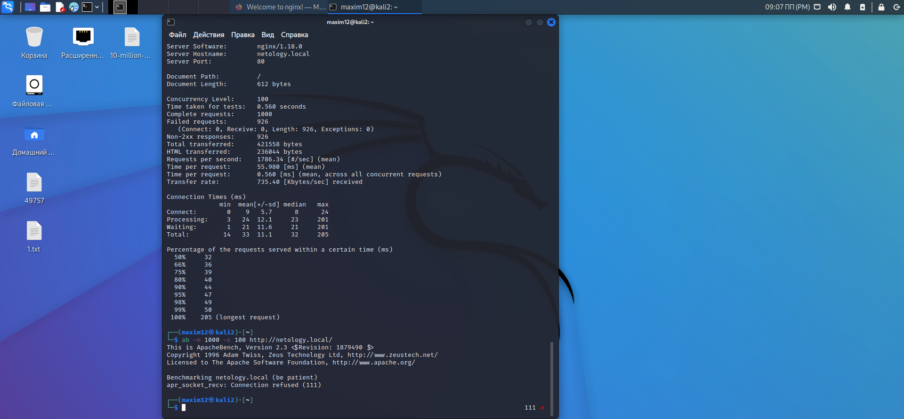

[Задание](https://github.com/netology-code/ibnet-homeworks/tree/v2/10-defence)

## до_включения_limit_req_на_nginx


## после_включения_limit_req_на_nginx


## после_включения_fail2ban



## Поведение_suricata


Вне зависимости от количества запросов, суриката детектирует неправильные TCP соединения, как я понял, они не завершаются до конца.
```
alert http $EXTERNAL_NET any -> $HOME_NET any (msg:“ET INFO Unconfigured nginx Access”; flow:from_server,established; http.stat_code; content:“200”; file.data; content:"|3C|title>
```

эта строчка отвечает за срабатывание правила. Она говорит о том, что у нас не настроен nginx сервер.
на каком основании: по порядку, если наш сервер отправляет кому-то ответ на запрос с кодом 200(Запрос к серверу успешен), а вот дальше я не смог до конца понять. Вроде бы это правило ищет в коде страницы контент </title>, который есть на стандартной странице nginx сервера и на этом основании считает, что сервер не настроен.
