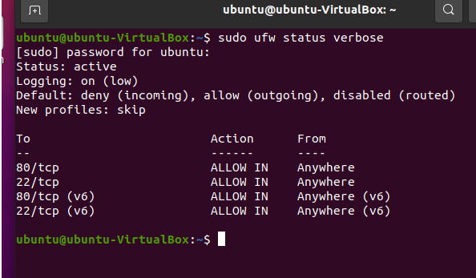
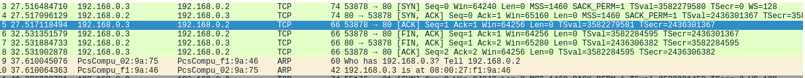
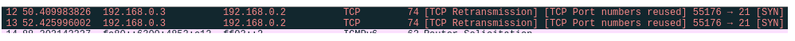

[Задание](https://github.com/netology-code/ibnet-homeworks/tree/v2/03_tcpudp)

# Задача 1

# Задача 2

Имеются две виртуальные машины 192.168.0.3 (Kali Linux) и 192.168.0.2(Ubuntu).

На  Ubuntu открыт порт 80, так что при обращении  Kali Linux к ней получаем следующую картину:

3.Kali посылает запрос на создание соединения SYN к порту 80  Ubuntu. В этом сегменте присутствует и порт Kali, на который будет отвечать Ubuntu.

4.Ubuntu отвечает сегментами с флагами SYN, который синхронизирует счетчики передаваемых данных и ACK, который сообщает, что принял сегмент с флагом SYN от Kali.

5.Kali отвечает ACK (принял)

6.Kali запрашивает разрыв соединения и отправляет FIN. Так же он отправляет флаг ACK, хотя в соответствии с учебником не должен.
7.Ubuntu отвечает FIN, ACK.

8.Kali отвечает ACK, соединение закрыто.

На  Ubuntu закрыт порт 21. Видим:

Kali дважды отправляет сегменты с флагами SYN, но не получает ответа. 
