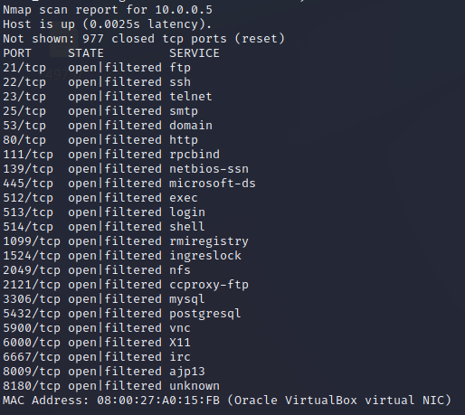

[Задание](https://github.com/netology-code/ibnet-homeworks/tree/v2/09_attacks)

## Metastable
1. Какие сетевые службы в ней разрешены? 

2. Какие уязвимости были вами обнаружены (список со ссылками - достаточно 3х уязвимостей) 

• На порте 21 запущен ftp сервер версии vsftpd 2.3.4.
https://www.exploit-db.com/exploits/49757
Можно получить доступ к файловой системе сервера.
• На порте 445 запущен Samba smbd 3.0.20
https://www.exploit-db.com/exploits/16320
Уязвимость позволяет выполнить произвольные команды на сервере. 
На порте 2121 запущен ProFTPD 1.3.1
https://www.exploit-db.com/exploits/15449
Уязвимость позволяет выполнить произвольные команды на сервере. 

## SYN, FIN, Xmas, UDP

• SYN. sudo nmap 10.0.0.5 -sS
Кали отправляет на сервер TCP пакет с флагом SYN. Это начало трехкратного рукопожатия. Если сервер отвечает пакетом RST, то порт открыт. Если сервер отвечает пакетом RST,ACK – порт закрыт. Кали линукс не завершает рукопожатие. 
• FIN. sudo nmap 10.0.0.5 -sF 
Кали отправляет на сервер TCP пакет с флагом FIN. Что по идее означает конец соединения. Если сервер отвечает пакетом RST,ACK – порт закрыт. Если сервер не отвечает, то состояние порта опознаётся как open|filtered. Если ответ с сервера ICMP port unreachable error (type 3, code 3), порт filtered.

• Xmas. sudo nmap 10.0.0.5 -sX
Кали отправляет на сервер TCP пакет с флагами [FIN, PSH, URG].Если сервер отвечает пакетом RST,ACK – порт закрыт. Если сервер не отвечает, то состояние порта опознается как open|filtered. Если ответ с сервера ICMP port unreachable error (type 3, code 3), порт filtered.

• UDP. sudo nmap 10.0.0.5 -sU
Кали линукс отправляет пустой UDP пакет на сервер, если сервер отвечает, то порт открыт (в моём примере, 111 порт ответил Remote Procedure Call, Type:Reply XID:0x72fe1d13.)
Если ответ с сервера не приходит, то порт маркируется nmap как open | filtered.
Если ответ с сервера ICMP port unreachable error (type 3, code 3), порт closed.

