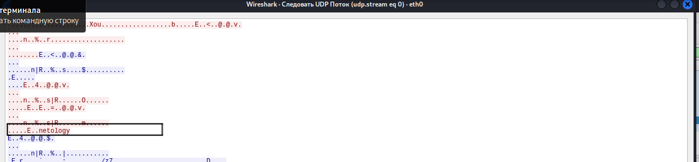
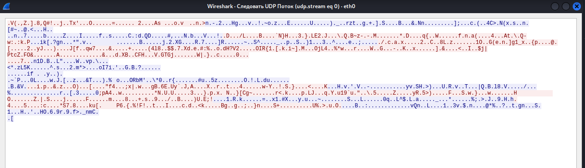

[Задание](https://github.com/netology-code/ibnet-homeworks/tree/v2/04_vpn)

# 1. Пришлите скриншот Wireshark, где видно, что данные передаются в открытом виде (для раздела PlainText)

# 2. Пришлите скриншот Wireshark, где видно, что данные не передаются в открытом виде (для раздела Shared Key)

На сервере или на клиенте запустите команду с флагом --verb 3, например, на Kali - sudo openvpn --ifconfig 10.1.0.2 10.1.0.1 --dev tun --remote 10.0.0.1 --secret vpn.key --verb 3
Внимательно изучите вывод и пришлите ответы на следующие вопросы:
3. Какая версия OpenSSL используется
OpenSSL 1.1.1n  15 Mar 2022
4. Какой алгоритм (и с какой длиной ключа) используется для шифрования
Cipher 'BF-CBC' initialized with 128 bit key
5. Какой алгоритм (и с какой длиной ключа) используется для HMAC аутентификации
160 bit message hash 'SHA1' for HMAC authentication
6. Что будет выведено в консоли сервера (sudo openvpn --ifconfig 10.1.0.1 10.1.0.2 --dev tun --secret vpn.key --cipher AES128 --auth SHA256 --verb 3), если:
6.1. Подключиться с клиента командой: sudo openvpn --ifconfig 10.1.0.2 10.1.0.1 --dev tun --remote 10.0.0.1 --secret vpn.key --cipher AES256 --auth SHA256 --verb 3
Authenticate/Decrypt packet error: cipher final failed
Такое произошло ,так как на сервере используется алгоритм шифрования  AES128, а клиент пытается подключится с алгоритмом шифрования  AES256.
6.2. Подключиться с клиента командой: sudo openvpn --ifconfig 10.1.0.2 10.1.0.1 --dev tun --remote 10.0.0.1 --secret vpn.key --cipher AES128 --auth SHA512 --verb 3
Authenticate/Decrypt packet error: packet HMAC authentication failed

Такое произошло, так как на сервере используется алгоритм для HMAC аутентификации  SHA256  а клиент пытается подключится с  SHA512.