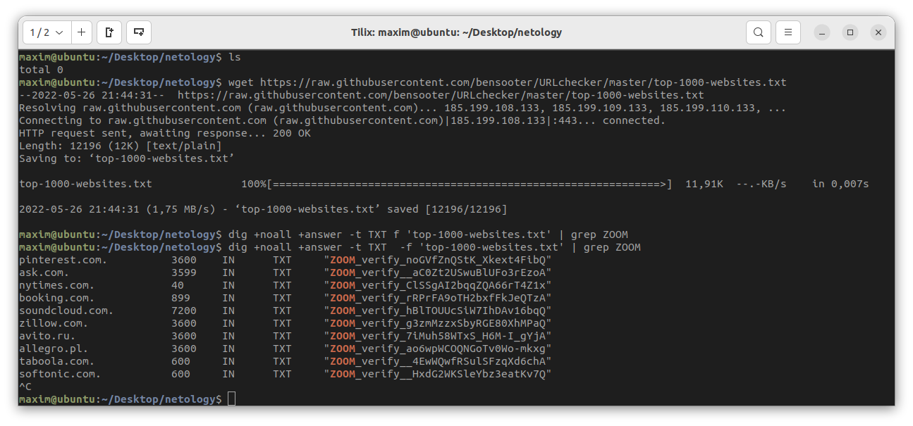

[Задание](https://github.com/netology-code/ibnet-homeworks/tree/v2/06_internet)
# Zoom



Порядок моих действий:
1.В гугле по запросу ‘most popular sites txt’ нашёл список из 1000 сайтов.
2.Скачиваю этот файл. Он называется  top-1000-websites.txt
3.В терминале ввожу:
```
	dig @8.8.8.8 +noall +answer -t TXT  -f 'top-1000-websites.txt' | grep ZOOM
```

dig @8.8.8.8 – выбираем ДНС сервер гугла.

+noall +answer – по дефолту программа dig выводит большой ответ, так как для задания нам нужна только секция ‘ANSWER’, убираем всё остальное.
-t TXT выбираем тип текстовых файлов.
-f 'top-1000-websites.txt' выбираем тот самый файл со списком сайтов.
| grep ZOOM отсеиваем ответы программы. Эта часть запроса выводит на экран только строчки, которые содержат слово ‘ZOOM’.
4.Прерываю выполнение программы, так как в задании просили только пять сайтов. 