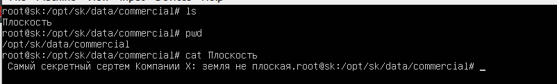
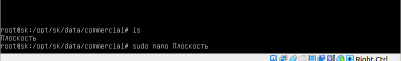
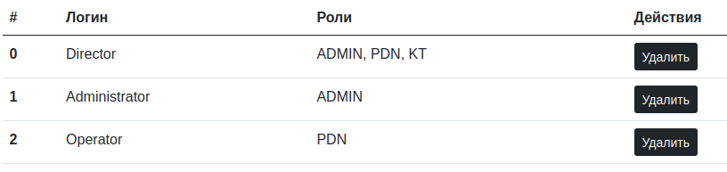
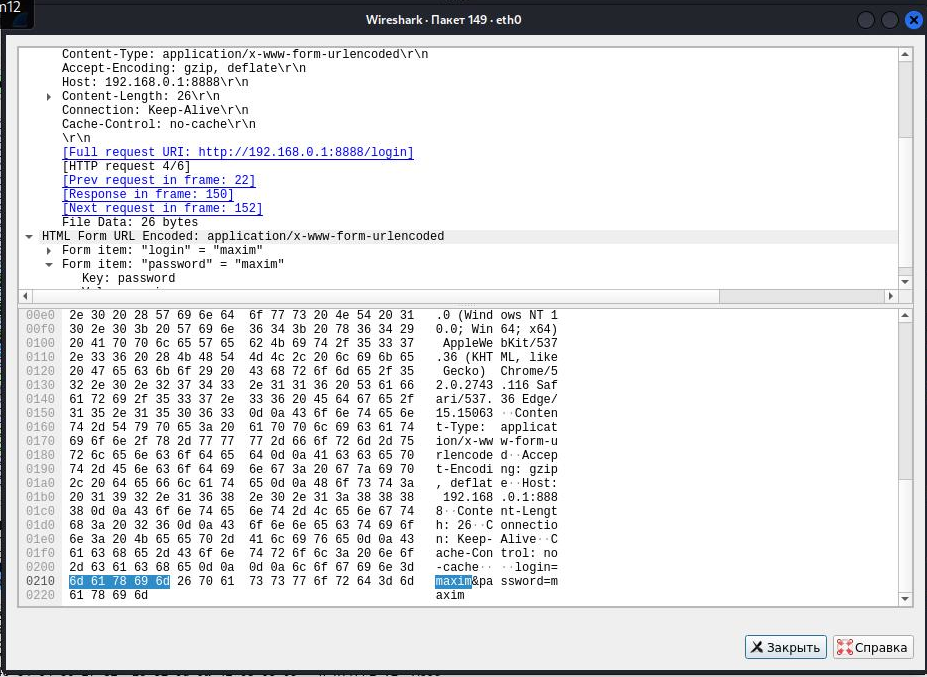
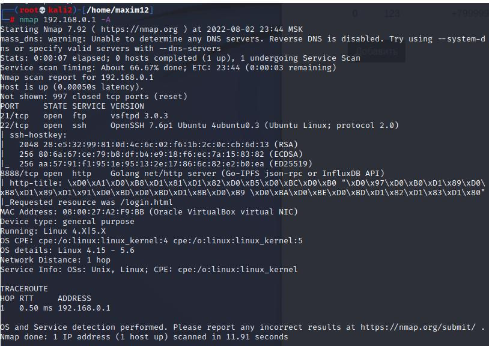
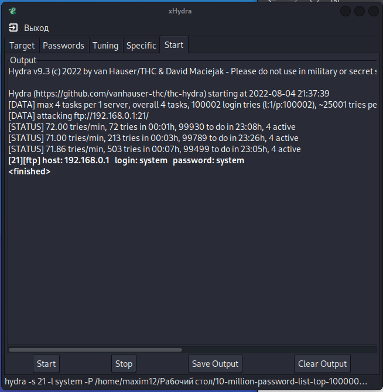

[Задание](https://github.com/netology-code/sib-secure-kontur-diploma)

Курсовая недоделанная, но её приняли, вот ответ преподавателя с замечаниями:

```
Добрый день!

По первой части - зачет.
По второй части есть ряд замечаний:

    2)Пароль при первом запуске храниться в открытом, незашифрованом виде. Если пароль не сменят, это может стать проблемой.

В большинстве систем существует пользователь или пароль по умолчанию, для которого нужно сменить пароль после первого доступа. Соответственно, подбор пароля по умолчанию не является уязвимостью, т.к. пользователь обязан сменить этот пароль.

Вместе с этим вы указали две настоящие уязвимости:

    хранение документов в открытом виде;
    использование протокола HTTP.

Поэтому, ставлю зачет по курсовой.

С уважением,
Алексей

```

Мой комментарий:

```
Помогите пожалуйста. Чтобы успешно здать курсовую, нужно проэксплуатировать две уязвимости.
Я смог найти только 1. И это брутфорс.
Смог на сервере найти какой-то ключ приватный, но расшифровать им базу с клиентами и юзерами не получается.
Смог “подсмотреть” пароль в вайршарк, можно это сделать так же через bettercap, но наверное это не до конца соответствует заданию.
DOS атака на сервер тоже не сработала. Использовал hping3, пакеты летят, но сервер работает.
```

## Часть I. Несоответствия системы требованиям нормативных документов.

### 1. Приказ ФСТЭК от 18 февраля 2013 № 21


При составлении отчета я полагал, что Компания Х берет на себя построение безопасной сети и администрирование системы linux ubutu 18.04.5 предоставляемую разработчиками, настройку антивирусных решений, защиту среды виртуализации и физический доступ к серверу.

I. Идентификация и аутентификация субъектов доступа и объектов доступа (ИАФ)

1. ИАФ.3 Управление идентификаторами, в том числе создание, присвоение, уничтожение идентификаторов.

Не выполнен механизм изменения уникальных идентификаторов у пользователя.

2. ИАФ.4 Управление средствами аутентификации, в том числе хранение, выдача, инициализация, блокирование средств аутентификации и принятие мер в случае утраты и (или) компрометации средств аутентификации.

Невозможно изменить пароль в случае его утери или компрометации. Изменить права доступа тоже нельзя.

3. ИАФ.5 Защита обратной связи при вводе аутентификационной информации. 

Не скрыт пароль пользователя при вводе.

II. Управление доступом субъектов доступа к объектам доступа (УПД)

1. УПД.1Управление (заведение, активация, блокирование и уничтожение) учетными записями пользователей, в том числе внешних пользователей.

Не выполнен механизм блокирования и активации учетной записи сотрудников.

2. УПД.2 Реализация необходимых методов (дискреционный, мандатный, ролевой или иной метод), типов (чтение, запись, выполнение или иной тип) и правил разграничения доступа.

Нет разграничения прав пользователей на чтение, запись, выполнение.


### 2. Федеральный закон от 29.07.2004 N 98-ФЗ (ред. от 14.07.2022) "О коммерческой тайне" Статья 10. Охрана конфиденциальности информации
1.5) нанесение на материальные носители, содержащие информацию, составляющую коммерческую тайну, или включение в состав реквизитов документов, содержащих такую информацию, грифа "Коммерческая тайна" с указанием обладателя такой информации (для юридических лиц - полное наименование и место нахождения, для индивидуальных предпринимателей - фамилия, имя, отчество гражданина, являющегося индивидуальным предпринимателем, и место жительства).

Нет возможности пометить документ грифом с указанием обладателя. Так же нет возможности разделить владельцев документа. Не все документы с грифом «коммерческая тайна» может смотреть отдельно взятый сотрудник.

5.1 ) исключается доступ к информации, составляющей коммерческую тайну, любых лиц без согласия ее обладателя.

Информация храниться в незашифрованом виде, так что администратор компьютера может видеть всё что содержит документ.


## Часть II. Найденные слабости, которые могут привести к уязвимостям.

1.) Документы с грифом коммерческая тайна храняться в незашифрованном виде.

Так же её можно менять. 

Просмотр секретной информации.






Редактирование секретной информации.

Пример измененной информации.


Предлагаю шифровать информацию на моменте, когда она попадает на сервер.

2)Пароль при первом запуске храниться в открытом, незашифрованом виде. Если пароль не сменят, это может стать проблемой.

Предлагаю не генерировать его, а чтобы администратор задавал его при первом запуске сам.

3)Механизм прав пользователя не работает.



Логинимся под «администратором» и имеем доступ к коммерческой тайне и клиентам. 

4) Сервер запускается на http. Поэтому можно перехватить пароль, например с помощью атаки «человек посередине».



## Часть III. Практика.

Сканируем сеть.



Попробовал с помощью hydra подобрать пароль к ftp. 

