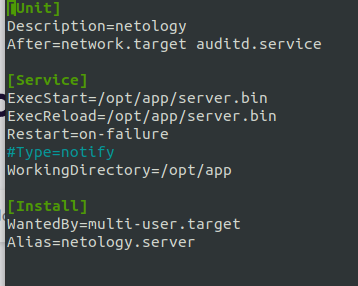

[Задание](https://github.com/netology-code/ibos-homeworks/tree/master/03_nix)

## «ОС Linux (часть 2)»
### 1. Скриншот, либо содержимое файла app.service 

### 2. Ответы на впоросы: 

1. На каком IP и порту запускается сервис 
0.0.0.0:9999
2. Кто (IP и порт) шлёт запросы на этот сервис и на какой путь 
127.0.0.1:41748  - порт меняется 
/api/token
3. Какие ответы (формат) получает клиент из п.ii получает в ответ на свои запросы 
{"ID":"63c2a93665ae5a8ec7fd(этот пункт меняется)","status":"ok"}
4. Какой ответ (HTTP статус код) получите вы, если пошлёте из браузера запрос на этот же адрес (сертификат самоподписанный, поэтому вам необходимо принять его) 
HTTP 403 Forbidden. В логах отражается запрос из браузера, но ответ с ID и status отсутствует

