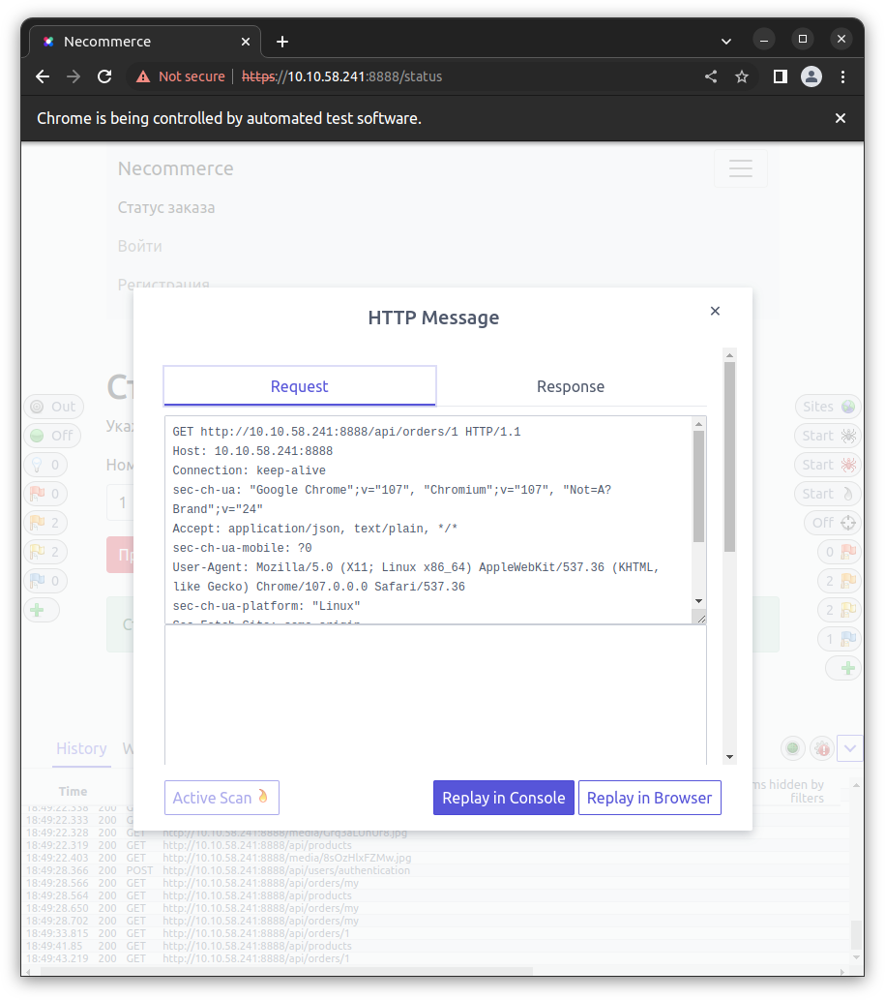
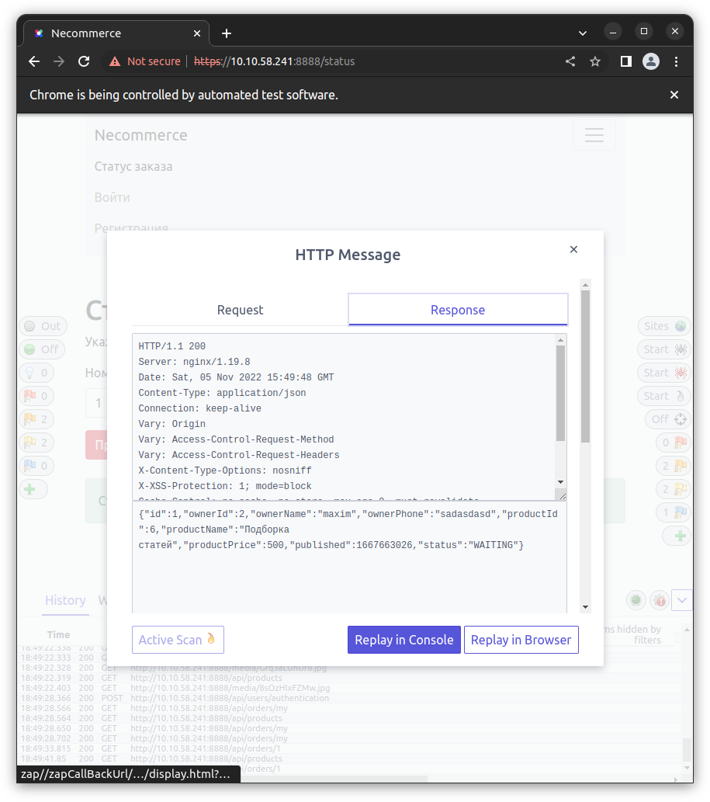

# Курсовая работа «E-Commerce». Профессия «Специалист по информационной безопасности»

## Планирование

|Номер | Объект исследования | Инструменты | Время на исследование | Даты начала и окончания этапа |
|:---:|---|---|---|---|
|1|Репозиторий https://github.com/netology-code/necommerce-frontend |Snyk, Trufflehog| 4 часа| 1 ноября 2022 - 1 ноября 2022 |
|2|Репозиторий https://github.com/netology-code/necommerce-backend|Snyk, Trufflehog|4 часа| 1 ноября 2022 - 1 ноября 2022 |
|3|Файл package.json| Snyk| 4 часа| 2 ноября 2022 - 2 ноября 2022 |
|4|Web интерфейс|OWASP ZAP, Ручное исследование| 8 часов |3 ноября 2022- 3 ноября 2022 |
|5|Составление отчета|- | 8 часов| 4 ноября 2022 - 5 ноября 2022 |

## Уровни уязвимостей, использованые в данном отчете

В графе "Градация уязвимостей по критичности" Я использовал две оценки. Первая - университета [nist](https://www.nist.gov/), вторая - сервиса [snyk](https://docs.snyk.io/features/fixing-and-prioritizing-issues/issue-management/severity-levels#understanding-snyks-vulnerability-analysis).

|Уровень|Описание|
|---|---|
|__Low__ |Уязвимость разоблачает информацию, структуру приложения, которые позволяют использовать другие уязвимости |
|__Medium__ |Уязвимость позволяет, при некоторых условиях, получить доступ к чувствительной информации |
|__High__ |Уязвимость позволяет получить доступ к чувствительной информации |
|__Critical__| Уязвимость позволяет получить доступ к чувствительной информации, так же запускать сторонний код |

## 1.Репозиторий [necommerce-frontend](https://github.com/netology-code/necommerce-frontend)(Докер контейнер)

### Snyk

Просканировав репозиторий, я выбрал уязвимости, критичные на мой взгляд.

|Номер | Уязвимая библиотека | Уязвимость|Вектор атаки |Потенциальный ущерб |Путь решения |Градация уязвимостей по критичности|
|:---:|---|---|---|---|---|---|
|1|tiff/libtiff5|CVE-2022-3570\Out-of-bounds Write|Атакующий получить доступ к памяти через особое TIFF изображение |Падение приложения, утечка информации, другие последствия, основаные на загрузке медиафайлов.|Обновления для библиотеки отсутствуют.|Snyk: CVSS 9.8 - __Critical__ Severity/NVD: CVSS 9.8 - __Critical__ Severity |
|2|curl/libcurl4|CVE-2022-42916\Cleartext Transmission of Sensitive Information|Атакующий может обойти механизм проверки протокола: Используется ли HTTPS вместо HTTP. Путем замены кодировок некоторый символов в URL |Утечка информации|Обновления для библиотеки отсутствуют|Snyk: CVSS 7.5 - __High__ Severity/NVD: CVSS 7.5 - __High__ Severity |
|3|expat/libexpat1|CVE-2022-43680\Use After Free|Уязвимость, связанная с некорректным использованием динамической памяти в процессе работы программы: при освобождении ячейки памяти указатель на нее не обнуляется, что позволяет хакерам воспользоваться ею в своих целях.|Утечка информации|Обновить библиотеку на expat/libexpat1@2.2.10-2+deb11u5 |Snyk: CVSS 7.5 - __High__ Severity/NVD: CVSS 7.5 - __High__ Severity |
|4|tiff/libtiff5|CVE-2022-3599\Out-of-bounds Read|Атакующий может вызвать отказ сервиса через особое TIFF изображение|Падение приложения|Обновления для библиотеки отсутствуют.|Snyk: CVSS 6.5 - __Medium__ Severity/NVD: CVSS 6.5 - __Medium__ Severity |
|5|tiff/libtiff5 |CVE-2022-3598,CVE-2022-3627,CVE-2022-3597,CVE-2022-3626\Out-of-bounds Write|Атакующий получить доступ к памяти через особое TIFF изображение |Падение приложения, утечка информации, другие последствия, основаные на загрузке медиафайлов.|Обновления для библиотеки отсутствуют.|Snyk: CVSS 6.5 - __Medium__ Severity/NVD: CVSS 6.5 - __Medium__ Severity |

### Меры по предотвращению атак:
Следует обновить библиотеку expat/libexpat1.
Так как обновление других уязвимых библиотек нет, а все атаки используют медиафайлы, стоит предусмотреть обработку загруженных на сервер медиафайлов, в особенности TIFF изображений.

### Trufflehog
В репозитории не найдено ключей и других подобных данных, которые должны быть скрыты.

[Полный отчет trufflehog](trufflehog-front.txt)

## 2.Репозиторий [necommerce-backend](https://github.com/netology-code/necommerce-backend)(Докер контейнер)

### Snyk

Просканировав репозиторий, я выбрал уязвимости, критичные на мой взгляд.
|Номер | Уязвимая библиотека | Уязвимость|Вектор атаки |Потенциальный ущерб |Обновленная библиотека, с исправленной уязвимостью|Градация уязвимостей по критичности|
|:---:|---|---|---|---|---|---|
|1|curl/libcurl4|CVE-2022-32207\Incorrect Default Permissions|В момент, в который curl финально сохраняет файлы(например  cookies), он переименовывает временный файл в финальный, в этот момент разрешения для этого файла могут стать шире изначальных и файл доступен для большего числа пользователей.|Утечка временных файлов|Upgrade Debian:11 curl to version 7.74.0-1.3+deb11u2 or higher.|Snyk: CVSS 9.8 - __Critical__ Severity/NVD: CVSS 9.8 - __Critical__ Severity |
|2|unzip|CVE-2022-0530\Out-of-bounds Write|Атакующий получить доступ к памяти через особый ZIP файл |Падение приложение или утечка данных|unzip@6.0-26+deb11u1|Snyk: CVSS 5.5 - __Medium__ Severity/NVD: CVSS 5.5 - __Medium__ Severity |
|3|expat/libexpat1|CVE-2022-40674\Use After Free|Уязвимость, связанная с некорректным использованием динамической памяти в процессе работы программы: при освобождении ячейки памяти указатель на нее не обнуляется, что позволяет хакерам воспользоваться ею в своих целях.|Утечка информации|expat/libexpat1@2.2.10-2+deb11u4 |Snyk: CVSS 9.8 - __Critical__ Severity/ NVD: CVSS 9.8 - __Critical__ Severity |
|4|pcre2/libpcre2-8-0 |CVE-2022-0530\Out-of-bounds Write|||unzip@6.0-26+deb11u1|Snyk: CVSS 9.1 - __Critical__ Severity/NVD: CVSS 9.1 - __Critical__ Severity |
|5|zlib/zlib1g|CVE-2022-37434\Out-of-bounds Write|Переполнение буфера, при использовании больших zip файлов|Падение приложения|zlib/zlib1g@1:1.2.11.dfsg-2+deb11u2|Snyk: CVSS 9.8 - __Critical__ Severity/NVD: CVSS 9.8 - __Critical__ Severity |
|6|git/git-man| CVE-2022-39260\Out-of-bounds Write| Исполнение нелегетимного кода| Падение приложение или утечка данных| git/git-man@1:2.30.2-1 and git@1:2.30.2-1 |Snyk: CVSS 8.8 - __High__ Severity/NVD: CVSS 8.8 - __High__ Severity |
|7|glibc/libc6|CVE-2021-3999\Off-by-one Error|Исполнение произвольного кода и повышение привилегий в системе локального пользователя |Утечка данных|glibc/libc6@2.31-13+deb11u4 |Snyk: CVSS 7.8 - __High__ Severity/NVD: CVSS 7.8 - __High__ Severity |
|8|gnutls28/libgnutls30|CVE-2022-2509\Double Free||Может возникнуть ошибка приложения|gnutls28/libgnutls30@3.7.1-5+deb11u2 |Snyk: CVSS 7.5 - __High__ Severity NVD: CVSS 7.5 - __High__ Severity |
|9|libtirpc/libtirpc3|CVE-2021-46828\Allocation of Resources Without Limits or Throttling||Отказ сервиса в обслуживании|libtirpc/libtirpc3@1.3.1-1+deb11u1 |Snyk: CVSS 7.5 - __High__ Severity NVD: CVSS 7.5 - __High__ Severity |

### Меры по предотвращению атак:

Обновить все указанные выше библиотеки на новые.

### Trufflehog

В репозитории, в первоначальном комите содержится структура запросов на сервер и тестовые логины и пароли. Рекомендую убрать из репозитория эту информацию. Оценка этой уязвимости - __Medium__ , так как репозитории с кодом не публичны и доступны только определенному кругу лиц, но доступ к информации возможен.

[Полный отчет trufflehog](trufflehog-back.txt)

## 3.Файл package.json

В файле Файл package.json содержится информация о версиях библиотек и программ, которые используются в проекте.
Если информация в нем не актуальна, стоит обновить её, если актуальна, обновить следующие библиотеки, скрипты и методы:

__

|Библиотеки, скрипты и методы с уязвимостью|Обновленные версии|Градация уязвимостей по критичности|
|:---:|:---:|:---:|
|ejs |ejs@3.1.7 |Snyk: CVSS 8.1 - __High__ Severity\NVD: CVSS 9.8 - __Critical__ Severity|
|ansi-regex|ansi-regex@3.0.1, @4.1.1, @5.0.1, @6.0.1 |Snyk: CVSS 7.5 - __High__ Severity/NVD: CVSS 7.5 - __High__ Severity|
|axios|axios@0.21.3 | Snyk: CVSS 7.5 - __High__ Severity\NVD: CVSS 7.5 - __High__ Severity|
|nth-check|nth-check@2.0.1 |Snyk: CVSS 7.5 - __High__ Severity\NVD: CVSS 7.5 - __High__ Severity|
|shell-quote|shell-quote@1.7.3 |Snyk: CVSS 8.1 - __High__ Severity\NVD: CVSS 9.8 - __Critical__ Severity|
|immer|immer@9.0.6 |Snyk: CVSS 5.6 - __Medium__ Severity/NVD: CVSS 9.8 - __Critical__ Severity|
|browserslist|browserslist@4.16.5 |Snyk: CVSS 5.3 - __Medium__ Severity/NVD: CVSS 5.3 - __Medium__ Severity|
|glob-parent |glob-parent@5.1.2 |Snyk: CVSS 5.3 - __Medium__ Severity/NVD: CVSS 7.5 - __High__ Severity|
|prompts|prompts@2.4.2 |Snyk: CVSS 5.3 - __Medium__ Severity/NVD: Not available. NVD has not yet published its analysis.|
|minimatch|minimatch@3.0.5 |Snyk: CVSS 5.3 - __Medium__ Severity/NVD: CVSS 7.5 - __High__ Severity|
|ejs|ejs@3.1.6 |Snyk: CVSS 4.1 - __Medium__ Severity/NVD: NVD only publishes analysis of vulnerabilities which are assigned a CVE ID. This vulnerability currently does not have an assigned CVE ID.|
|url-parse|url-parse@1.5.9 |Snyk: CVSS 8.1 - __High__ Severity/NVD: CVSS 9.8 - __Critical__ Severity|
|async|async@2.6.4, @3.2.2 |Snyk: CVSS 7.5 - __High__ Severity/NVD: CVSS 7.8 - __High__ Severity|
|ssri| ssri@6.0.2, @7.1.1, @8.0.1 |Snyk: CVSS 7.5 - __High__ Severity/NVD: CVSS 7.5 - __High__ Severity|
|tmpl|tmpl@1.0.5 |Snyk: CVSS 7.5 - __High__ Severity/NVD: CVSS 7.5 - __High__ Severity|
|eventsource|eventsource@1.1.1, @2.0.2 |Snyk: CVSS 6.5 - __Medium__ Severity/NVD: CVSS 9.3 - __Critical__ Severity|
|json-schema| json-schema@0.4.0 |Snyk: CVSS 8.6 - __High__ Severity/NVD: CVSS 9.8 - __Critical__ Severity|
|tar|tar@6.1.9, @5.0.10, @4.4.18|Snyk: CVSS 8.5 - __High__ Severity/NVD: CVSS 8.6 - __High__ Severity|Snyk: CVSS 7.7 - __High__ Severity/NVD: CVSS 6.5 - __Medium__ Severity|
|dns-packet |dns-packet@1.3.4, @5.2.4|Snyk: CVSS 7.7 - __High__ Severity/NVD: CVSS 6.5 - __Medium__ Severity|
|unset-value|unset-value@2.0.1 |Snyk: CVSS 7.5 - __High__ Severity/NVD: NVD only publishes analysis of vulnerabilities which are assigned a CVE ID. This vulnerability currently does not have an assigned CVE ID.|
|follow-redirects|follow-redirects@1.14.7 |Snyk: CVSS 5.3 - __Medium__ Severity/NVD: CVSS 6.5 - __Medium__ Severity|
|hosted-git-info|hosted-git-info@3.0.8, @2.8.9 |Snyk: CVSS 5.3 - __Medium__ Severity/NVD: CVSS 5.3 - __Medium__ Severity|
|is-svg|is-svg@4.3.0 |Snyk: CVSS 5.3 - __Medium__ Severity/ NVD: CVSS 7.5 - __High__ Severity|
|node-forge |node-forge@1.0.0 |Snyk: CVSS 5.3 - __Medium__ Severity/ NVD: CVSS 6.1 - __Medium__ Severity|
|path-parse|path-parse@1.0.7 |Snyk: CVSS 5.3 - __Medium__ Severity/NVD: CVSS 7.5 - __High__ Severity|
|postcss|postcss@8.2.13, @7.0.36 |Snyk: CVSS 5.3 - __Medium__ Severity/NVD: CVSS 7.5 - __High__ Severity|
|postcss |postcss@7.0.36, @8.2.10 |Snyk: CVSS 5.3 - __Medium__ Severity/NVD: CVSS 5.3 - __Medium__ Severity|
|ws|ws@7.4.6, @6.2.2, @5.2.3|Snyk: CVSS 5.3 - __Medium__ Severity/NVD: CVSS 5.3 - __Medium__ Severity|
|nwsapi|nwsapi@2.2.1 |    Snyk: CVSS 6.2 - __Medium__ Severity/NVD: NVD only publishes analysis of vulnerabilities which are assigned a CVE ID. This vulnerability currently does not have an assigned CVE ID.|
|nanoid|nanoid@3.1.31 |Snyk: CVSS 4.0 - __Medium__ Severity/NVD: CVSS 5.5 - __Medium__ Severity|

## Web интерфейс

## Автоматическое сканирование OWASP-ZAP

### Content Security Policy (CSP) Header Not Set

__CWE 693__
Статус уязвимости - __Critical__

Content Security Policy - это мера безопасности, которая помогает обнаружить или смягчить некоторые виды атак, включая XSS. Эта политика содержит стандартные HTTP заголовки, которые разрешают владельцу веб сайта объявить только надежные источники медиафайлов, которые загружаются на сайт.

### Cross-Domain Misconfiguration

__CWE 264__
Статус уязвимости - __High__

Cross-origin resource sharing — технология современных браузеров, которая позволяет предоставить веб-страницам доступ к ресурсам другого домена.
Неверная настройка этой технологии допускает read запросы от произвольных источников.
Рекомендую удостовериться, что чувствительная информация не доступна с неавторизованных источников, например начать использовать "белый" список IP адресов.
Либо вовсе удалить CORS заголовки.

### Missing Anti-clickjacking Header

__CWE 1021__
Статус уязвимости - __High__

Clickjacking - это механизм обмана пользователя путем подмены страницы через iframe. Злоумышленник может создать страницу с прозрачным iframe сайта на который производится атака и разместить привлекательный контент под ним. Пользователь кликая по контенту на сайте совершает действие на другом ресурсе не подозревая об этом.

Решением будет запрет отображения во фрейме через заголовок ответа сервера X-Frame-Options.

X-Frame-Options в заголовке HTTP-ответа может использоваться для указания того, разрешено ли браузеру открывать страницу в frame или iframe.

Для X-Frame-Options есть три параметра:

SAMEORIGIN: этот параметр позволяет отображать страницу в frame в том же месте, что и сама страница.

DENY: этот параметр предотвратит отображение страницы в frame или iframe.

ALLOW-FROM URI: этот параметр позволяет отображать страницу только по указанному url.

## Ручное исследование.

### Возможность неавторизованого просмотра заказа.
Статус уязвимости - __High__

Если сменить пользователя, но вписать в статус заказа корректный номер, то сайт ответит "WAITING". Значит можно узнать статус не своего заказа.

Более того , в HTTP Response сайт отсылает отсылает полностью информацию о заказе: Имя заказавшего, его телефон и что он заказал.

